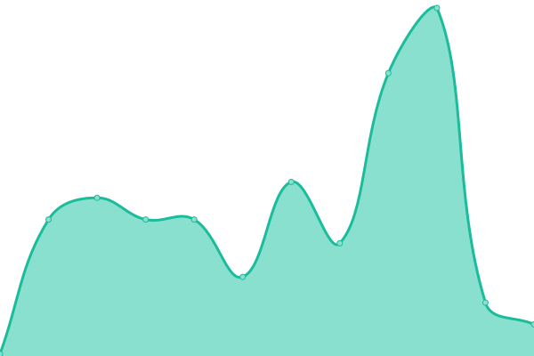

# [📈 Live Status](https://cloudback.it): <!--live status--> **🟩 All systems operational**

This repository contains the open-source uptime monitor and status page for [Cloudback](https://cloudback.it), powered by [Upptime](https://github.com/upptime/upptime).

With [Upptime](https://upptime.js.org), you can get your own unlimited and free uptime monitor and status page, powered entirely by a GitHub repository. We use [Issues](https://github.com/cloudback/upptime/issues) as incident reports, [Actions](https://github.com/cloudback/upptime/actions) as uptime monitors, and [Pages](https://cloudback.it) for the status page.

<!--start: status pages-->
<!-- This summary is generated by Upptime (https://github.com/upptime/upptime) -->
<!-- Do not edit this manually, your changes will be overwritten -->
<!-- prettier-ignore -->
| URL | Status | History | Response Time | Uptime |
| --- | ------ | ------- | ------------- | ------ |
|  [Cloudback Landing](https://cloudback.it) | 🟩 Up | [cloudback-landing.yml](https://github.com/cloudback/status/commits/HEAD/history/cloudback-landing.yml) | 

 246ms
     
 | 

<a href="https://status.cloudback.it/history/cloudback-landing">100.00%</a>
    

|  [Cloudback Web](https://app.cloudback.it/health) | 🟩 Up | [cloudback-web.yml](https://github.com/cloudback/status/commits/HEAD/history/cloudback-web.yml) | 

 366ms
     
 | 

<a href="https://status.cloudback.it/history/cloudback-web">100.00%</a>
    

|  [Cloudback Identity Server](https://app.cloudback.it/identity/health) | 🟩 Up | [cloudback-identity-server.yml](https://github.com/cloudback/status/commits/HEAD/history/cloudback-identity-server.yml) | 

 58ms
     
 | 

<a href="https://status.cloudback.it/history/cloudback-identity-server">100.00%</a>
    

|  [Cloudback Backend Service](https://app.cloudback.it/api/health) | 🟩 Up | [cloudback-backend-service.yml](https://github.com/cloudback/status/commits/HEAD/history/cloudback-backend-service.yml) | 

 54ms
     
 | 

<a href="https://status.cloudback.it/history/cloudback-backend-service">100.00%</a>
    

|  [Cloudback Workers](https://app.cloudback.it/health-workers) | 🟩 Up | [cloudback-workers.yml](https://github.com/cloudback/status/commits/HEAD/history/cloudback-workers.yml) | 

 2219ms
     
 | 

<a href="https://status.cloudback.it/history/cloudback-workers">100.00%</a>
    

<!--end: status pages-->

[**Visit our status website →**](https://cloudback.it)

## 📄 License

- Powered by: [Upptime](https://github.com/upptime/upptime)
- Code: [MIT](./LICENSE) © [Anand Chowdhary](https://anandchowdhary.com), supported by [Pabio](https://pabio.com)
- Data in the `./history` directory: [Open Database License](https://opendatacommons.org/licenses/odbl/1-0/)
